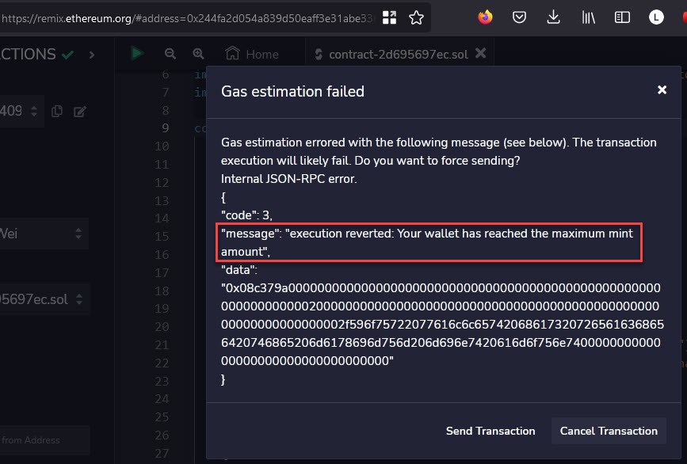

#  NFT Smart Contract (ERC721) - week 1

:book: [Alchemy University](https://docs.alchemy.com/docs/1-how-to-develop-an-nft-smart-contract-erc721-with-alchemy): How to Develop an NFT Smart Contract (ERC721) with Alchemy

#### Proof

:globe_with_meridians: [Deployed NFT Smart Contract](https://goerli.etherscan.io/address/0x3B6DD7145CF84633f791EF192CF86A2B70A2e02E)

:globe_with_meridians: [Contract code in Remix IDEA](https://remix.ethereum.org/)

:globe_with_meridians: [OpenSea NFT](https://testnets.opensea.io/assets/goerli/0x0ae822ac5206ccc1b42a61b9e3552591500cfbb7/7)

:globe_with_meridians: [filebase](https://filebase.com/)

:globe_with_meridians: [Open Zeppelin](https://docs.openzeppelin.com/contracts/4.x/wizard)

Screenshot confirming the implemented require statement does not let a wallet mint more than the maximum amount specified.

#### Social

:herb: [coding.lens](https://lenster.xyz/u/mxmxgbd.lens) :herb:

:herb: [twitter](https://twitter.com/mxmxgbd) :herb: